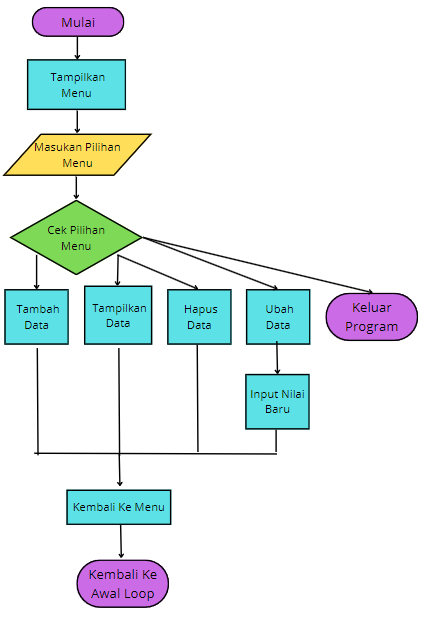
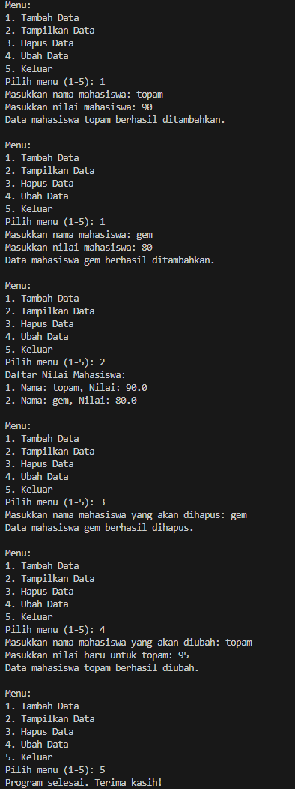

# labpy06

- Nama : Roufan Awaluna Romadhon
- NIM : 31210423
- Kelas : TI.24.A.3

---

## Deskripsi
Program ini dikenal dengan nama Nilai Mahasiswa, yang akan membantu pengguna mengelola data mahasiswa dengan cara lebih efisien. Menu interaktif atas program ini akan memudahkan pengguna melakukan operasi: menambah, menampilkan, menghapus, dan memperbarui nilai mahasiswa dengan inputan berupa nama mahasiswa. Proses ini dilakukan dalam bentuk siklus agar pengguna bisa melakukan banyak operasi tanpa harus keluar dari program hingga proses selesai. Setiap operasi di dalamnya diterangkan secara sopan dan jelas untuk mudah diikuti.

Khususnya program ini dirancang agar pengelolaan data nama-nama dan nilai-nilai mahasiswa lebih mudah melalui antarmuka berbasis teks yang sederhana.

---

## Program Manajemen Data Nilai Mahasiswa

### Deskripsi Program:
Program ini adalah aplikasi sederhana untuk mengelola data nilai mahasiswa. Pengguna dapat menambahkan, menampilkan, menghapus, dan mengubah data mahasiswa melalui menu interaktif berbasis teks. Setiap operasi dilakukan secara berulang hingga pengguna memilih keluar dari program. Program ini dirancang dengan antarmuka yang mudah dipahami untuk membantu pembelajaran dasar pemrograman.

### Kode Program
Kode program dapat dilihat dibawah ini atau buka file ini [`FungsiNilai.py`](FungsiNilai.py).
```python
# MengInisialisasi list untuk menyimpan data mahasiswa
data_mahasiswa = []

# Fungsi untuk menambah data mahasiswa
def tambah():
    nama = input("Masukkan nama mahasiswa: ")
    nilai = float(input("Masukkan nilai mahasiswa: "))
    data_mahasiswa.append({'nama': nama, 'nilai': nilai})
    print(f"Data mahasiswa {nama} berhasil ditambahkan.\n")

# Fungsi untuk menampilkan data mahasiswa
def tampilkan():
    if not data_mahasiswa:
        print("Tidak ada data mahasiswa.\n")
    else:
        print("Daftar Nilai Mahasiswa:")
        for i, mahasiswa in enumerate(data_mahasiswa, start=1):
            print(f"{i}. Nama: {mahasiswa['nama']}, Nilai: {mahasiswa['nilai']}")
        print()

# Fungsi untuk menghapus data mahasiswa berdasarkan nama
def hapus(nama):
    for mahasiswa in data_mahasiswa:
        if mahasiswa['nama'].lower() == nama.lower():
            data_mahasiswa.remove(mahasiswa)
            print(f"Data mahasiswa {nama} berhasil dihapus.\n")
            return
    print(f"Data mahasiswa dengan nama {nama} tidak ditemukan.\n")

# Fungsi untuk mengubah data mahasiswa berdasarkan nama
def ubah(nama):
    for mahasiswa in data_mahasiswa:
        if mahasiswa['nama'].lower() == nama.lower():
            nilai_baru = float(input(f"Masukkan nilai baru untuk {nama}: "))
            mahasiswa['nilai'] = nilai_baru
            print(f"Data mahasiswa {nama} berhasil diubah.\n")
            return
    print(f"Data mahasiswa dengan nama {nama} tidak ditemukan.\n")

# Menu utama
def menu():
    while True:
        print("Menu:")
        print("1. Tambah Data")
        print("2. Tampilkan Data")
        print("3. Hapus Data")
        print("4. Ubah Data")
        print("5. Keluar")
        pilihan = input("Pilih menu (1-5): ")

        if pilihan == '1':
            tambah()
        elif pilihan == '2':
            tampilkan()
        elif pilihan == '3':
            nama = input("Masukkan nama mahasiswa yang akan dihapus: ")
            hapus(nama)
        elif pilihan == '4':
            nama = input("Masukkan nama mahasiswa yang akan diubah: ")
            ubah(nama)
        elif pilihan == '5':
            print("Program selesai. Terima kasih!")
            break
        else:
            print("Pilihan tidak valid. Silakan pilih lagi.\n")

# Jalankan program
menu()

```

### Penjelasan Program:
Program ini adalah program sederhana untuk mengelola daftar nilai mahasiswa 
dengan beberapa fungsi utama, yaitu menambah data, menampilkan data, menghapus data, 
dan mengubah data berdasarkan nama mahasiswa. Berikut adalah penjelasan setiap bagian:

1. Inisialisasi Data:
   - Data mahasiswa disimpan dalam sebuah list bernama `data_mahasiswa` yang berisi dictionary
     dengan key 'nama' untuk nama mahasiswa dan 'nilai' untuk nilai mahasiswa.

2. Fungsi Tambah Data:
   - Fungsi `tambah()` meminta input nama dan nilai mahasiswa dari pengguna.
   - Data yang dimasukkan akan ditambahkan ke dalam list `data_mahasiswa`.

3. Fungsi Tampilkan Data:
   - Fungsi `tampilkan()` mencetak seluruh data mahasiswa yang ada dalam list.
   - Jika tidak ada data mahasiswa, akan ditampilkan pesan bahwa data kosong.

4. Fungsi Hapus Data:
   - Fungsi `hapus(nama)` mencari data mahasiswa berdasarkan nama.
   - Jika ditemukan, data mahasiswa tersebut dihapus dari list.
   - Jika tidak ditemukan, akan ditampilkan pesan bahwa nama tidak ditemukan.

5. Fungsi Ubah Data:
   - Fungsi `ubah(nama)` mencari data mahasiswa berdasarkan nama.
   - Jika ditemukan, nilai mahasiswa dapat diubah dengan nilai baru yang dimasukkan.
   - Jika tidak ditemukan, akan ditampilkan pesan bahwa nama tidak ditemukan.

6. Menu Utama:
   - Menu utama memberikan pilihan kepada pengguna untuk menambah data, menampilkan data, 
     menghapus data, mengubah data, atau keluar dari program.
   - Program terus berjalan hingga pengguna memilih opsi keluar.

7. Logika Utama:
   - Program menggunakan loop `while` untuk terus menjalankan menu hingga pengguna memilih untuk keluar.
   - Setiap pilihan menu diproses dengan memanggil fungsi yang sesuai.

Cara Menjalankan:
- Jalankan program dan pilih opsi dari menu yang disediakan dengan memasukkan angka 1-5.
- Ikuti instruksi sesuai dengan pilihan menu.

Tujuan Program:
- Program ini bertujuan untuk membantu pengguna mengelola data mahasiswa dengan cara yang sederhana 
  dan interaktif.

### Flowchart:
Flowchartnya adalah sebagai berikut:



### Screenshot Hasil Eksekusi Program:
Berikut adalah hasil eksekusi programnya:

